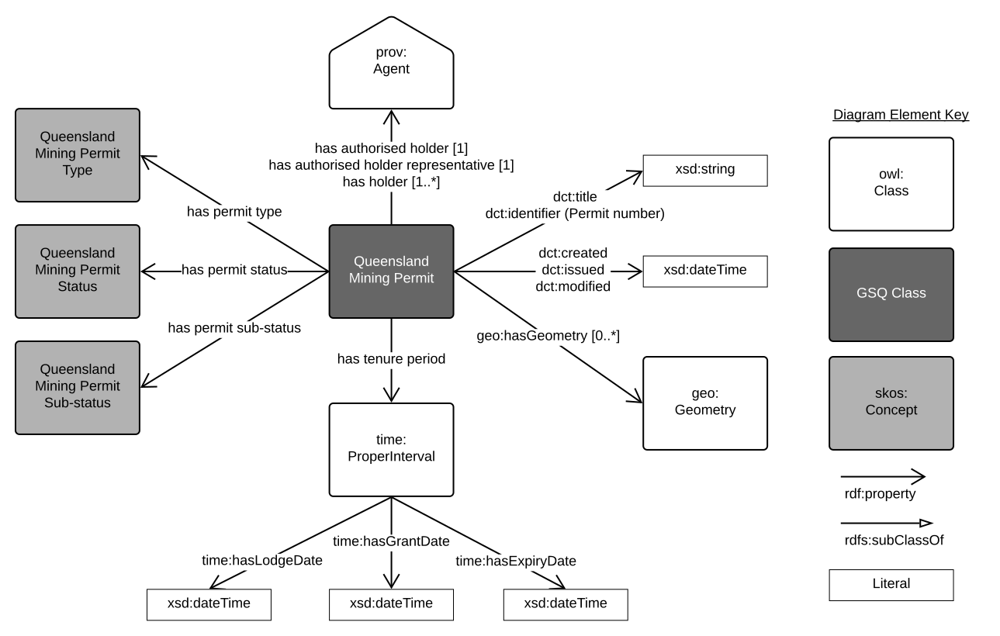
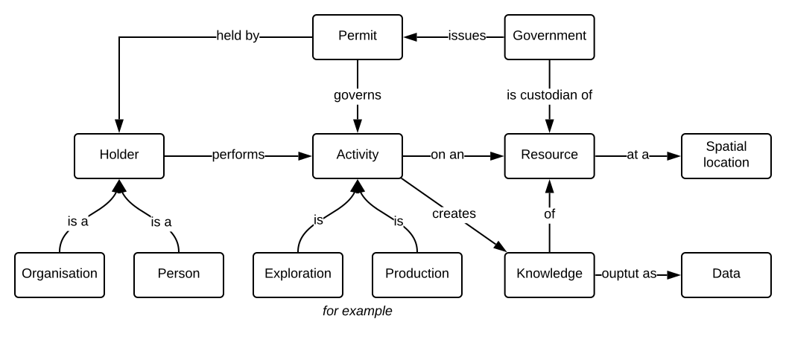

# GSQ Resource Permit Profile
In general mineral or energy rights in Australia are reserved to the Crown. The acquisition of rights to minerals or energy stems from legislative frameworks in Queensland. These frameworks provide initially for exploration of the resource, and consist of the grant by the Crown in the form of exploration permits, licences or leases.

Exploration permits, leases or licences permit works to be undertaken to determine the likely existence of minerals, energy or resources. Actual mining or energy extraction is subject to a further grant of production leases or licences.

The legislation also provides for the payment of royalties to the State and to compensate the owners or occupiers of the surface land.

Resource permits include `Petroleum and gas resource authorities`, `Mineral and coal resource authorities`, `Greenhouse gas storage authorities` and `Geothermal authorities`.

  

**Fig. 1**: The model of a permit.  

It is a profile of a permit. It is used for describing the [Geological Survey of Queensland (GSQ)](https://www.business.qld.gov.au/industries/mining-energy-water/resources)'s permits.

## Usage
A `permit` is the authority to perform exploration, appraisal, development or production activities on a resource at a location.

  

**Fig. 2**: The level 0 conceptual model of a permit.

## Profile Resources
This profile is presented as a series of files that perform different roles:

1. [model/](model/) - the *model* folder contains this profile's models in both graphical (SVG) and machine-readable, textual, form ( [RDF](https://www.w3.org/RDF/) turtle).
2. [shapes/](shapes/) - folder containing SHACL shapes files used to validate data's conformance to this profile's model.
3. [profile.ttl](profile.ttl) - the profile declaration. A description of all of the items in this profile (the formal model, validating resources, documentation etc.) according to the W3C's [Profiles Ontology](https://www.w3.org/TR/dx-prof/) which describes how all the parts related to one another, the roles they play (to give *guidance* for use, to *validate* data etc.) and how this profile *profiles* the various standards listed above.

## GSQ classes
No GSQ classes are used in this profile.

## OWL classes
1. [dct:title](https://w3c.github.io/dxwg/dcat/#Property:resource_title)
2. [dct:identifier](https://w3c.github.io/dxwg/dcat/#Property:resource_identifier) - Permit number e.g. EPM12345
3. [Geometry](https://www.w3.org/2003/01/geo/)
4. [ProperInterval](https://www.w3.org/TR/owl-time/#time:ProperInterval)

## Vocabularies
The vocabularies used in this profile are:
1. [Queensland Resource Permit](https://https://vocabs.gsq.digital/vocabulary/qld-resource-permit)
2. [Queensland Resource Permit Status](https://vocabs.gsq.digital/vocabulary/qld-mining-permit-status)

## License
The content of this repository is licensed for use with the [Creative Commons 4.0 License](https://creativecommons.org/licenses/by/4.0/). See the [license deed](LICENSE) for details.

## Contacts 
*owner*:  
**Mark Gordon**  
*Director - Geoscience Information*  
Geological Survey of Queensland  
<mark.gordon@dnrme.qld.gov.au>  

*author*:  
**David Crosswell**  
*Project Director*  
Geological Survey of Queensland  
<david.crosswell@dnrme.qld.gov.au> 
